# Приложение Fast Food

Сайт ресторана быстрого питания с доставкой заказов.

## Описание приложения

Данное приложение имеет микросервисную архитектуру
и предоставляет следующие возможности:

### 1. Для клиента:
- регистрации;
- авторизации;
- просмотра каталога блюд (меню);
- добавления блюд в корзину;
- просмотра корзины;
- оформления заказа;
- просмотра истории заказов;
- получения уведомлений об оплате заказа, создании заказа, готовности заказа,
доставке заказа.

### 2. Для администратора:
- авторизации;
- просмотра каталога блюд (меню);
- включения/исключения блюда в/из каталог(а);
- изменения названия, описания, стоимости, изображения блюда;
- просмотра нанятых/уволенных курьеров;
- увольнения и найма когда-то уволенных курьеров;
- добавления новых курьеров;
- просмотра истории заказов;
- просмотр подробной информации о каждом заказе.

## Используемый стек технологий

1. Java 17
2. Spring boot 2.5.2
3. Spring MVC
4. Spring Data JPA
5. Spring Security
6. Lombok 1.18.22
7. Liquibase 4.15.0
8. PostgreSQL 14

## Требуемое окружение
1. JDK 17
2. Apache Maven 3.8.5
3. PostgreSQL 14

### Spring boot
1. Открыть диалоговое окно комбинацией клавиш Win+R;
2. В диалоговом окне прописать cmd и нажать OK;
3. Подключиться к PostgreSQL командой ```psql --username=USER_NAME``` и ввести пароль;
4. Создать базу данных url_short_cut командой ```create database fast_food```;
5. Подключиться к базе данных командой ```\c fast_food```;
6. Выйти из терминала psql командой ```\q```;
7. Перейти в корневую папку проекта;
8. Перейти в корневую папку каждого из следующих модулей:

- admin;
- client;
- delivery;
- dish;
- kitchen;
- notification;
- order;
- payment;

и в каждом выполнить команду ```mvn spring-boot:run```;
9. Перейти по ссылке ```http://localhost:8090/client``` в браузере,
для авторизации в качестве клиента, либо...;
10. Перейти по ссылке ```http://localhost:8100/admin/login``` в браузере
для авторизации в качестве администратора (login: ```admin```, password: ```password```).

## Интерфейс сайта. Клиент 

### Регистрация

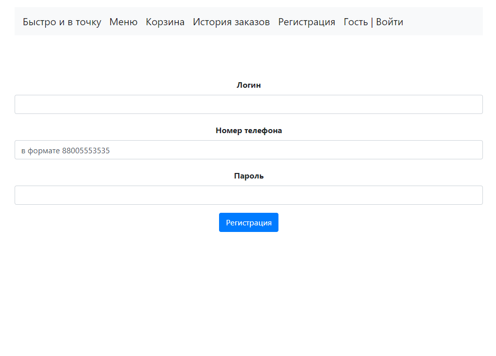

### Авторизация

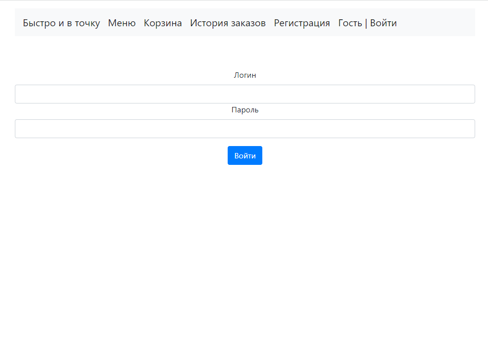

### Главная страница


### Меню

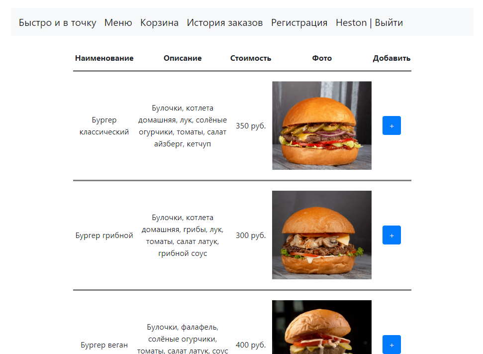

### Корзина

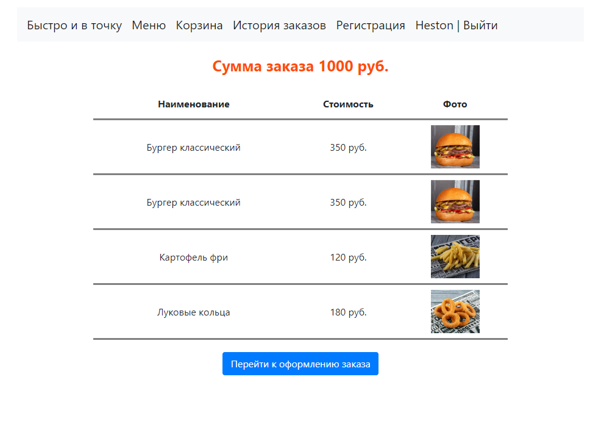

### Форма адреса заказа

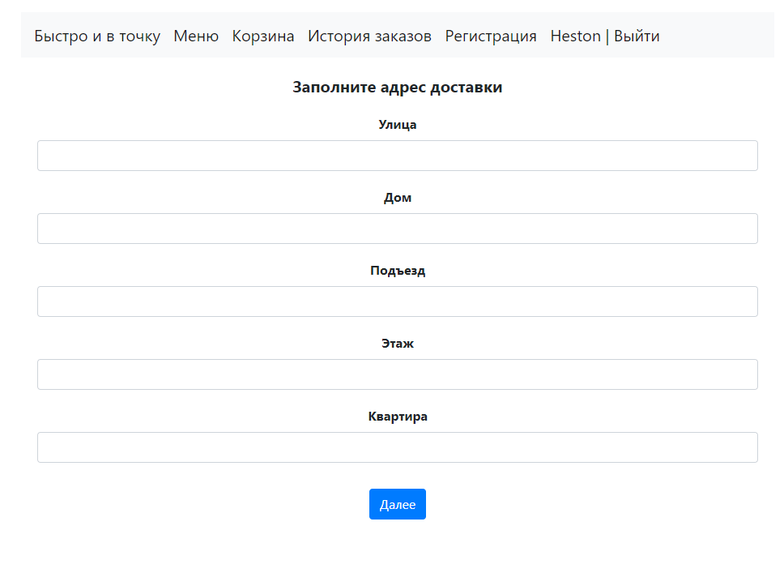

### Предпросмотр заказа

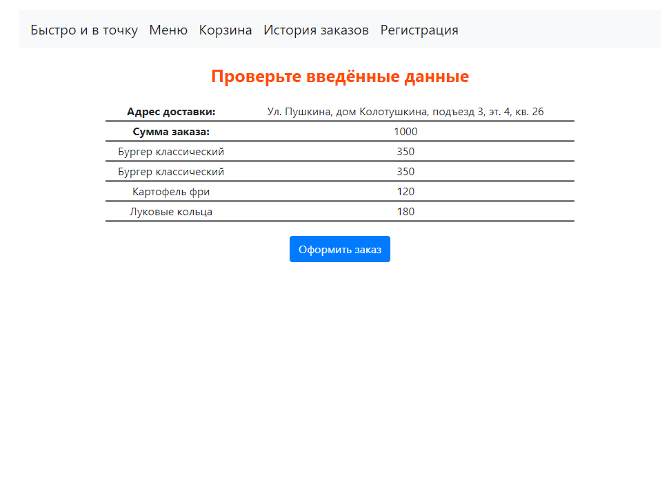

### Форма данных дебетовой карты

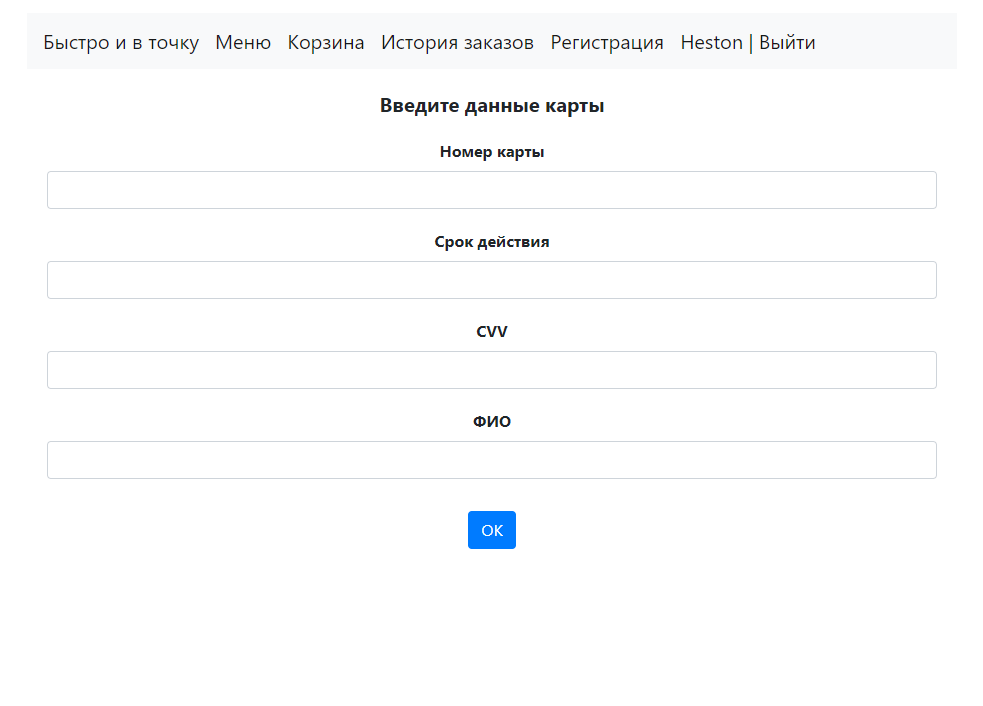

### История заказов

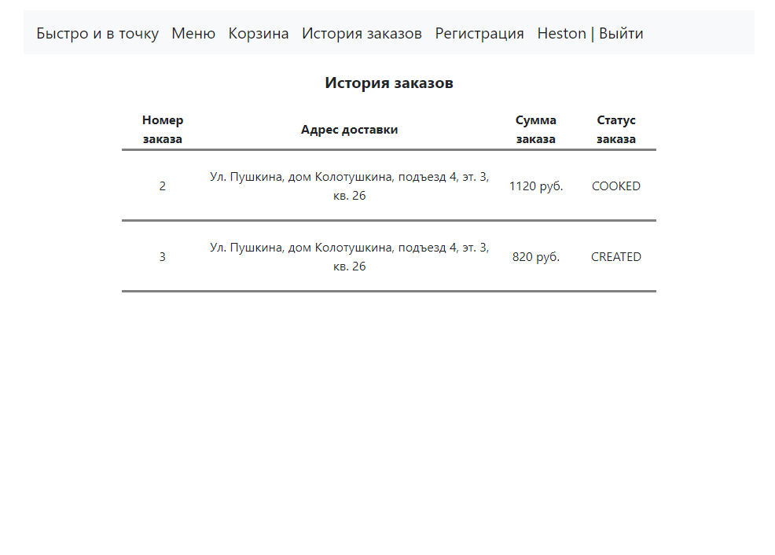

## Интерфейс сайта. Администратор

### Авторизация

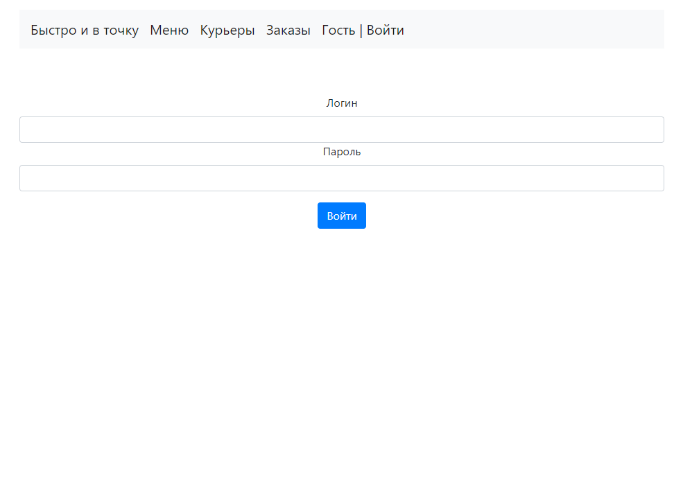

### Меню

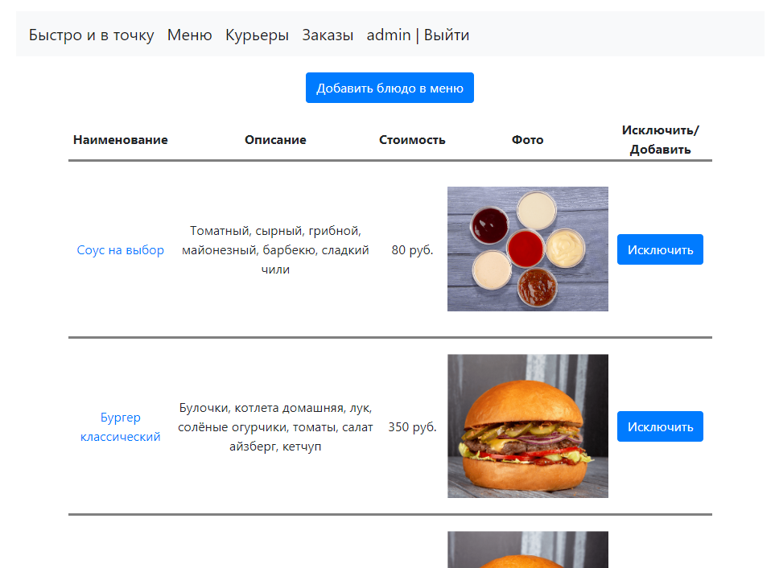

### Редактирование позиции меню

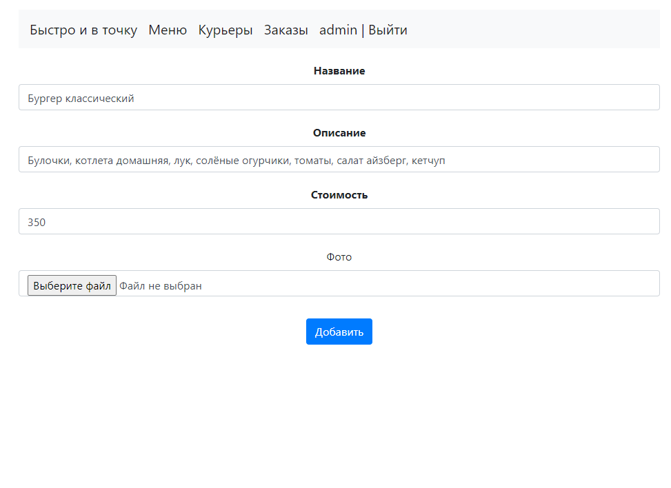

### Нанятые/уволенные курьеры

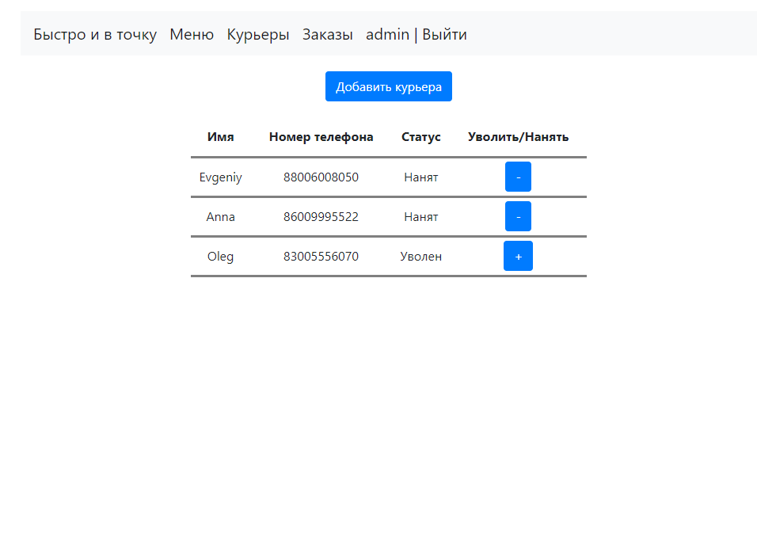

### Все заказы

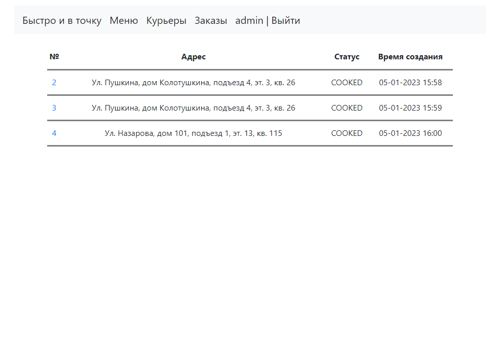


