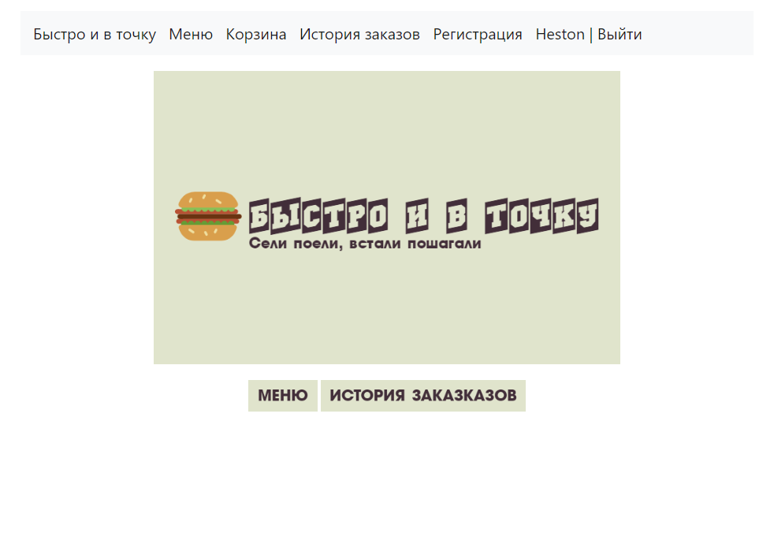
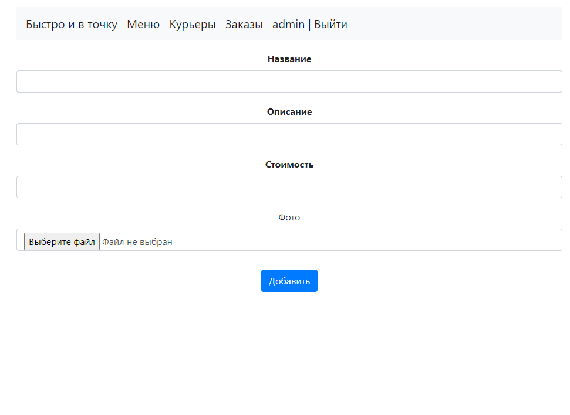
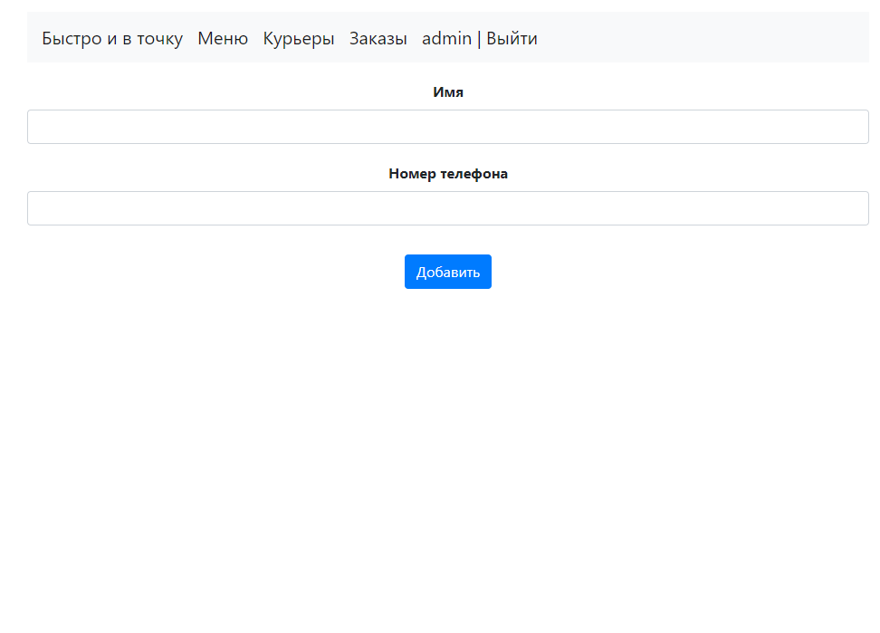
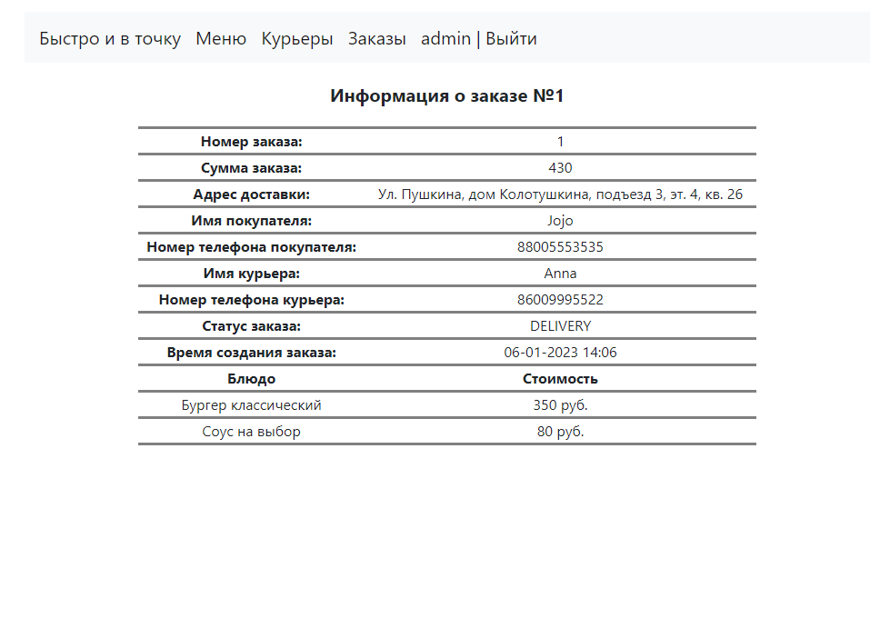

# Приложение Fast Food

Сайт ресторана быстрого питания с доставкой заказов.

## Описание приложения

Данное приложение имеет микросервисную архитектуру
и предоставляет следующие возможности:

### 1. Для клиента:
- регистрации;
- авторизации;
- просмотра каталога блюд (меню);
- добавления блюд в корзину;
- просмотра корзины;
- оформления заказа;
- просмотра истории заказов;
- получения уведомлений об оплате заказа, создании заказа, готовности заказа,
доставке заказа.

### 2. Для администратора:
- авторизации;
- просмотра каталога блюд (меню);
- включения/исключения блюда в/из каталог(а);
- изменения названия, описания, стоимости, изображения блюда;
- просмотра нанятых/уволенных курьеров;
- увольнения и найма когда-либо уволенных курьеров;
- добавления новых курьеров;
- просмотра истории заказов;
- просмотра подробной информации о каждом заказе.

## Используемый стек технологий

1. Java 17
2. Spring boot 2.5.2
3. Spring MVC
4. Spring Data JPA
5. Spring Security
6. Lombok 1.18.22
7. Liquibase 4.15.0
8. PostgreSQL 14
9. Kafka

## Требуемое окружение
1. JDK 17
2. Apache Maven 3.8.5
3. PostgreSQL 14
4. Kafka

### Spring boot
1. Открыть диалоговое окно комбинацией клавиш Win+R;
2. В диалоговом окне прописать cmd и нажать OK;
3. Подключиться к PostgreSQL командой ```psql --username=USER_NAME``` и ввести пароль;
4. Создать базу данных fast_food командой ```create database fast_food```;
5. Подключиться к базе данных командой ```\c fast_food```;
6. Выйти из терминала psql командой ```\q```;
7. Запустить Kafka;
8. Открыть 8 командных консолей (по количеству модулей);
9. В каждой консоли перейти в корневую директорию одного из модулей:

- admin;
- client;
- delivery;
- dish;
- kitchen;
- notification;
- order;
- payment;

и выполнить команду ```mvn spring-boot:run```;
9. Перейти по ссылке ```http://localhost:8090/client``` в браузере,
для авторизации в качестве клиента, либо...;
10. Перейти по ссылке ```http://localhost:8100/admin/login``` в браузере
для авторизации в качестве администратора (login: ```admin```, password: ```password```);
11. Для отображения изображений блюд в меню необходимо авторизоваться в
качестве администратора, перейти в раздел "Меню" и отредактировать каждое блюдо
добавив изображение расположенное по следующему пути: fast_food/dish/img/menu.

## Интерфейс сайта. Клиент 

### Регистрация


### Авторизация


### Главная страница



### Меню


### Корзина


### Форма адреса заказа


### Предпросмотр заказа


### Форма данных дебетовой карты


### История заказов


## Интерфейс сайта. Администратор

### Авторизация


### Меню


### Добавить в меню новую позицию



### Редактирование позиции меню


### Нанятые/уволенные курьеры


### Добавить курьера



### Все заказы


### Подробная информация о заказе




